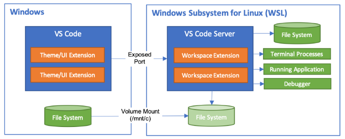
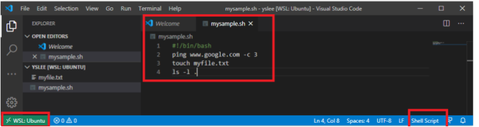

# Visual Studio Code Remote 
 VS Code에서 WSL에서 개발을위한 확장이 있다.   
 [Visual Studio Code Remote](https://marketplace.visualstudio.com/items?itemName=ms-vscode-remote.vscode-remote-extensionpack) - Windows 측에서 VS Code UI를 WSL VM에서 VS Code Server를 동작시킬 수 있는 WSL 확장이다.  
 WSL에서 명령을 직접 실행하여 마운트된 파일 시스템을 Linux 파일 시스템으로 처리하여 경로등 OS 간의 문제를 줄일 수 있다.  
       
  

## wsl2에서 vscode remote 사용하기  
[출처](https://cloudsns.wordpress.com/2020/05/22/wsl2%EC%97%90%EC%84%9C-vscode-remote-%EC%82%AC%EC%9A%A9%ED%95%98%EA%B8%B0/)  
    
VSCode Remote는 3가지 방식을 지원  
1. Windows 10의 WSL에 VSCode Server를 설치해서 WSL의 자원을 이용하는 방법  
2. Docker Container를 이용하는 방법  
3. 실제 Linux 서버에 SSH 방식 통신을 이용하는 방법  
  
Windows 10 version 2004에서 wsl2를 설치하면 vscode를 원격으로 붙어서 사용할 수 있다  
  
1)Windows 10 2004에 VSCode 설치  
2)Extension에 Remote Development 추가  
3)windows terminal 실행  
4)wsl  
5)cat /etc/*-release  
6)cd  
7)mkdir myproject  
8)cd !$  
9)code .  
  
이렇게 하면 Linux에서 Windows 10에 설치된 vscode에 접속하여 프로그래밍 작업을 할 수 있다.  
또는 bash script도 만들 수 있다.  
드디어 Linux에서 Script를 작성할 때 원격으로 vscode에 접속하여 쉽게 script를 사용할 수 있다.    
       

[(강추)VSCode Remote 사용하기 – SSH 방식](https://bit.ly/36jIIpv  )  
  