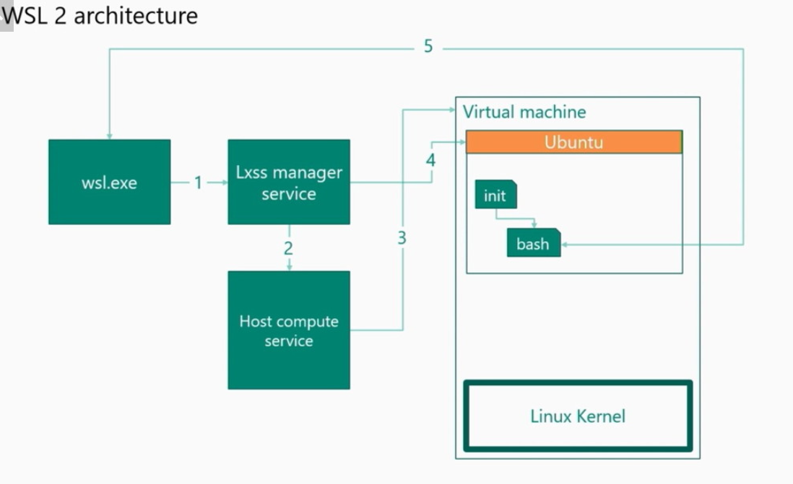
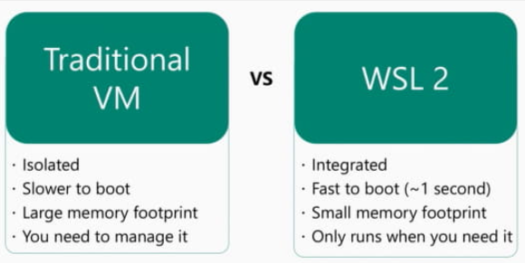
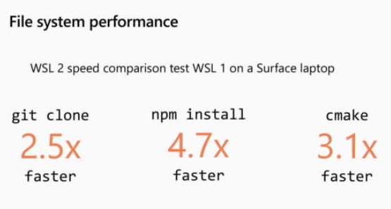
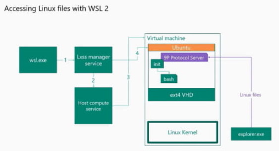

# WSL2
WSL2는 아키텍처 수준에서 WSL1과 다르다.  
WSL1이 Linux 시스템 콜과 Windows NT 커널 간의 변환층을 필요로 하는 반면, WSL2는 완전한 Linux 커널을 실행하는 경량 VM을 포함한다. 이 VM은 Windows Hipervisor 층에서 직접 실행한다.  
            
  
기존의 VM과의 차이  
            
    
커널은 시스템 호출의 완전 호환성을 갖추고 있기 때문에 Docker나 FUSE 등의 앱으로도 Linux에서 자연스럽게 실행 가능하다. 이 새로운 구현에서는 Linux 커널에서 Windows 파일 시스템에 대한 전체 액세스가 가능하게 되어 있다.  
  
또 파일 시스템 액세스가 필요한 상호 작용에서 성능이 크게 개선 되었다. Microsoft의 프로그램 관리자인 Craig Loewan씨에 의하면 응용 프로그램 파일 집합의 수준에 따라 다르지만 3 ~ 6배의 성능 향상이 가능하다고 한다. tar 압축 해제에서는 성능이 20배 향상된 예도 있다.  
            
    
WSL 2의 Linux 파일은 Windows의 파일 시스템(NTFS)가 아닌 EXT4로 포맷된 가상 하드웨어 디스크(VHD)에 저장된다. 그래서 WSL1에서 문제가되었던 디스크 접근 성능이 대폭으로 개선 되었다.
            
이 VHD는 필요에 따라서 자동적으로 확장되지만 초기 상태에서 최대에서의 최대 사이즈는 256GB로 제한 되어 있으므로 디스크 영역이 부족하면 에러가 발생한다. 이 경우는 수동으로 VHD 사이즈 제한을 완화해야 한다.  
  
Windows 10 2004 버전에서는 WSL2 설치 및 업데이트 프로세스는 매우 쉬운 것이 된다. 기존 Linux 커널은 Windows OS 버전의 일부로 포함 되어 있었지만, 이 다음 릴리스에서는 분리 되기 때문에 타사 드라이버를 설치할 때처럼 Windows Update를 통해 커널을 업데이트 할 수 있다.    
      
  
[microsoft/WSL2-Linux-Kernel](https://github.com/microsoft/WSL2-Linux-Kernel)  
[MS Doc Windows 10에 Linux용 Windows 하위 시스템 설치 가이드](https://docs.microsoft.com/ko-kr/windows/wsl/install-win10 )  
[WSL2(Windows Subsystem For Linux 2) 사용하기](https://medium.com/@seunghunhan_15321/wsl2-windows-subsystem-for-linux-2-%EC%82%AC%EC%9A%A9%ED%95%98%EA%B8%B0-a0998b84d5fe  )  

  
<br>  

## Windows 10에 WSL1 과 WSL2 설치하기
    
### 1.PowerShell 시작
"PowerShell"을 관리자 권한으로 실행한다.    
  
### 2.WSL 설치
아래 명령을 실행하여 "WSL"를 설치한다.  
```
dism.exe /online /enable-feature /featurename:Microsoft-Windows-Subsystem-Linux /all /norestart
```
    
설치가 완료되면 설치 결과가 표시된다.  
  
WSL 1만 이용하는 경우
- "WSL 1" 설치 완료는 이것으로 끝이다.
- "WSL 1"만 이용할 경우 PC를 다시 시작한다.
  
WSL 2도 이용하는 경우
- 아래에 이어지는 "3"의 단계를 수행한다.  
  

### 3.Virtual Machine Platform 설치
아래 명령을 실행하여 "Virtual Machine Platform"을 설치한다.  
```
dism.exe /online /enable-feature /featurename:VirtualMachinePlatform /all /norestart
```
  
설치가 완료되면 설치 결과가 표시된다.  
설치가 완료되면 PC를 다시 시작한다. 
  

### 4.WSL의 기본 버전을 2로 변경한다
"WSL 2"를 메인으로 사용하는 경우 아래 명령을 실행하여 'WSL"의 기본 버전을 "2"로 변경한다.  
```
wsl --set-default-version 2
```
    
이제 남은 것은 원하는 Linux 배포판을 설치하는 것 뿐이다.  
Linux 배포판은 「Microsoft Store」에서 설치한다.  
  
  
#### 명령어로 Linux 배포판 설치하기
Microsoft Store가 아닌 명령어로 Linux 배포판을 설치할 수 있다.   
아래는 PowerShell에서 명령어를 실행한다.  
  
1. 배포판 다운로드   
Ubuntu 20.04를 다운로드 한다  
```
Invoke-WebRequest -Uri https://aka.ms/wslubuntu2004 -OutFile Ubuntu.appx -UseBasicParsing
```  
  
2. 설치   
```
move .\Ubuntu.appx .\Ubuntu.zip
Expand-Archive .\Ubuntu.zip
```  
  
3. 배포판을 import    
```
cd Ubuntu
wsl.exe --import Ubuntu-20.04 'C:\wsl\Ubuntu-20.04' .\install.tar.gz

# import 되었는지 확인
wsl -l -v
```  
- Ubuntu-20.04: (임의의)배포판 이름
- 'C:\wsl\Ubuntu-20.04': (임의의)설치할 곳
  
  
4. (optional) 기본 배포판 설정   
```
wsl --set-default Ubuntu-20.04
```    
만약 이전에 Docker Desktop을 설치한 경우 등에서 기존 배포판을 변경하고 싶은 경우    
  
  
5. 작업 유저 설정  
이대로 사용하면 root 유저로 사용된다.  작업용 유저를 만들어보자.  
```
wsl --distribution Ubuntu-20.04
sudo adduser takelushi
usermod -aG sudo takelushi
```  
  
6. 로그인 유저 설정  
레지스터리 편집기를 연다  
- regedit.exe  

Ubuntu-20.04의 레지스터리를 찾는다  
```
HKEY_CURRENT_USER\SOFTWARE\Microsoft\Windows\CurrentVersion\Lxss
```  
  
DefaultUid를 0x3e8(1000) 으로 한다. UID가 1000 이외인 경우 그것에 맞춘다.  
   
   
<br>   
<br>   
  
## WSL 기본 버전 변경
"WSL"에는 "WSL 1" 과 "WSL 2"가 있으며, 이들은 동시에 설치할 수 있다.  
"WSL" 기본 버전을 변경하는 방법이다.
아래 명령으로 "WSL" 기본 버전을 변경할 수 있다.  
```
wsl --set-default-version <버전>
```
  
<버전>은 "1" 또는 "2"를 지정한다.  
예를 들어 "WSL 2"를 기본값으로 설정하려면 아래 명령을 실행한다.  
```
wsl --set-default-version 2
```
  
기본값은 WSL 1로 되어 있다.  
향후 기본 버전 설정은 "WSL 2"로 바뀔 예정이다.  
  
<br>      

## Linux 배포판이 사용하는 WSL 버전 변경
Linux 배포판은 어느 버전을 사용하여 시작한다.  
각 Linux 배포판에는 시작할 때 사용하는 "WSL" 버전이 설정되어 있으며, 이 설정에 따라 "WSL 1" 또는"WSL 2"를 사용한다.
Linux 배포판 설치 시 기본 "WSL" 버전이 설정된다.  
사용자는 기본 설정과 각 Linux 배포판의 설정을 나중에 변경할 수 있다.  
  
### Linux 배포판을 사용하는 "WSL"의 버전을 확인하는 방법
아래 명령으로 설치된 Linux 배포판과 함께 각 Linux 배포판을 사용하는 'WSL' 버전이 표시된다.  
```
wsl -l -v
```
  
"NAME" 열이 Linux 배포판 이름이다.  
"VERSION" 열이 "WSL" 버전을 보여준다.
  
  
### Linux 배포판이 사용하는 WSL의 버전을 변경하기
Linux 배포판이 사용하는 "WSL" 버전을 변경하는 방법이다.  
  
1.Linux 배포판 이름을 확인
우선 위의 방법으로 변경하는 Linux 배포판의 이름을 확인한다.  
  
2.WSL 버전을 변경
아래 명령으로 "WSL" 버전을 변경한다.  
```
wsl --set-version <배포판 이름> <버전>
```
  
<배포판 이름>은 "1"에서 조사한 Linux 배포판 이름을 입력한다.  
<버전>은 "1" 또는 "2"를 지정한다.  
  
예를 들어 "Ubuntu 18.04 LTS" 버전을 "2"로 변경하려면 아래 명령을 실행한다.  
```
wsl --set-version Ubuntu-18.04 2
```
  
WSL2 커널 업데이트를 하라는 에러(**에러: 0x1bc**)가 나오면 수동으로 업데이트 한다. 아래 사이트에서 다운로드 프로그램을 실행한다.    
  https://docs.microsoft.com/ko-kr/windows/wsl/wsl2-kernel  
      
머신 성능에 따라서 변경에 시간이 걸릴 수 있다.  
    
<br>    
  
## WSL 재시작 하기
WSL2에서 알 수 없는 이유로 어떤 기능이 동작하지 않을 때 해결하는 방법  
```
wsl --shutdown
```  
위 명령어로 wsl을 재 시작하도록 한다.    
  
<br>  
  
## X Server를 이용하기 위한 설정(DISPLAY 환경 변수를 자동 설정한다)  
WSL의 디스플레이 설정 공정에서 WSL2 측의 ip 주소를 지정해야 한다.  
이 글에서는 ipconfig로 확인하여 설정하고 있지만, 글에도 있듯이 다시 시작할 때마다 ip 주소가 달라진다는 문제가 있다.  
아래와 같은 명령으로 WSL2 측에서 ip 주소를 취득하고, DISPLAY 환경 변수에 넣을 수 있다. 이것을 설정 파일(zshrc 든지)에 적어 놓으면 부팅 시 자동으로 설정하는 것이 가능하다.  
```
export DISPLAY=$(cat /etc/resolv.conf | grep nameserver | awk '{print $2}'):0
```

[WSL2에서의 VcXsrv 설정](https://docs.google.com/document/d/1CLaBM7zyXq02OVJiS1GoYOy14Kidl_moOewSdoYWzLE/edit?usp=sharing )  
   
<br>      
  
## Windows에서 wsl2의 명령어 실행하기
wsl 명령어에 `-e` 옵션을 붙여서 실행한다.  
```
wsl -d '디스트리뷰션 이름' -e '실행할 명령어'
```   
아래는 CentOS8에서 cat 명령어를 실행하는 예    
```
wsl -d CentOS8 -e cat /etc/os-release
```  
  
     
## windows와 linux 간의 파일 이동이나 명령어 실행
  
### wsl 이 설치되어 있는 디렉토리에 접근하기 
microsoft store에서 설치하거나 wsl 명령어로 설치한 wsl 용 파일류는 `%userprofile%\AppData\Local\Packages` 라는 숨김 폴더에 설치된다.   
탐색기에서 위 주소를 입력하면 접근할 수 있다.  
  
  
### linux 에서 windows의 폴더에 접근하기
linux에서 보이는 windows 시스템 드라이브는 `/mnt/` 아래에 마운트 되어 있다.  
    
    
### linux에서 현재 디렉토리를 windows 탐색기에서 열고 싶다면
wsl의 linux에서는 windows의 명령어를 실행할 수 있으므로 linux에서 탐색기를 실행할 수 있다.  
windows 폴더로 현재 있는 디렉토리를 표시할 수 있다.   
```
uchi@CP747755-01:/home$ explorer.exe .
```
   
   
### linux에서 Windows 프로그램 실행하기
windows에서 path에 지정된 프로그램은 바로 실행하고, 아니면 풀 패스를 지정해서 실행한다.     
```
/mnt/c/Windows/System32/mspaint.exe
``` 
    
<br>      
  
## 네트워크
WSL1에서는 Windows 10쪽 에뮬레이션을 실시하기 위해, Linux 측에서 TCP/IP 등의 프로토콜은 처리하지 않고, Windows 10의 네트워크 기능을 이용한다. 따라서 Linux의 IP 주소도 Windows 10 쪽과 동일하게 된다.  

이것애 비해 WSL2는 가상 머신에서 Linux 커널이 동작하여 네트워크 스택도 작동하기 때문에 IP 주소는 Win32 측과는 다른 것을 사용한다. 이 때, 가상 네트워크(가상 네트워크 스위치)가 만들어지고, 자신의 내부 네트워크에 WSL2와 Win32 측의 가상 네트워크 어댑터를 연결한 구조가 된다. 현재 이 IP 주소 할당은 WSL2의 가상 네트워크가 기동할 때 발생하므로 반드시 일정한 IP 주소가 되는 것은 아니다.  
  
그러나 Windows 10 쪽에서는 항상 WSL2 측은 Localhost로 액세스가 가능한 구조이다. 이것은 WSL2 측에서 수신 포트(Listen 포트)를 Win32 측의 소프트웨어가 중계하는 것으로 이루어진다.  
  
또한 WSL2 내에서는 "/etc/resolv.conf"에 기재되어 있는 DNS 서버가 항상 Win32 측의 가상 네트워크 측 IP 주소를 나타내게 되어 있다(이 파일은 WSL2 시작 시 자동 생성된다). 이 구조를 이용하여 Linux 측에서도 일정한 단계에서 Win32 측의 IP 주소를 얻는 것이 가능하다.  
      
[WSL 2의 네트워크 통신 방법](https://www.sysnet.pe.kr/2/0/12347 ) 
  	
<br>  

## WSL2의 git을 Windows 10에서 사용하기
1. [여기](https://github.com/andy-5/wslgit/releases)에서 다운로드 후 원하는 위치에 둔다.
2. 일반적인 git으로 사용하고 싶다면 1에서 받은 실행파일의 이름을 git.exe 로 변경한다.
  
<br>    
  
## 디스트리뷰션 import & export
WSL export 기능으로 환경을 통째로 tar 파일로 출력 할 수 있다.  
`wsl --export (export 하고 싶은 WSL 환경 이름) (출력 파일 이름)`을 실행하면 된다.  
```
PS C:\Users\user01\export_distro> wsl --export Ubuntu-20.04 FocalFossa_copy.tar
```  
이것으로 원래 Ubuntu-20.04의 환경이 tar 파일로 출력 되므로, 이제 남은 것은 이것을 다른 환경 이름을 붙여서 import 하면 동일한 환경을 얻을 수 있다.   
`wsl --import (WSL 아래에 등록할 환경 이름) (export path) (import 환경.tar)` 를 실행하 면된다.  
```
PS C:\Users\user01\export_distro> wsl --import FocalFossa_copy ..\wsl_manual_install\ FocalFossa_copy.tar
```  
이것으로 지정한 환경 이름에 원본 Ubuntu-20.04와 동일한 환경이 복제 되었다.  
<pre>
PS C:\Users\user01> wsl -l --verbose
  NAME                      STATE           VERSION
* Ubuntu-20.04              Running         2
  FocalFossa_copy           Stopped         2
  docker-desktop            Running         2
  docker-desktop-data       Running         2
</pre>  
  
터미널에서 `wsl -d (환경 잉름)`을 쳐서 시작해도 좋고, 또는 Windows Terminal의 타이틀 바의 ∨버튼에서 볼 수있는 환경 목록에서 선택해서 시작한다.   
<pre>
PS C:\Users\user01> wsl -l --verbose
  NAME                      STATE           VERSION
* Ubuntu-20.04              Running         2
  FocalFossa_copy           Running         2
  docker-desktop            Running         2
  docker-desktop-data       Running         2
</pre>  
  
또한 import 시에 지정한 설치한 곳에 환경의 실체인 하드 디스크 이미지 파일 `ext4.vhdx`이 생성 되어 있지만, 내용은 `\\wsl$\` 아래에 마운트 되어 있으므로 이쪽에서 탐색기에서 검색 할 수 있다.   
  
필요 없게된 환경을 삭제하고 싶을 때는 `wsl --unregister (등록 이름)` 으로 삭제할 수 있다.  
    
<br>    
  
## 수동으로 WSL2 및 리눅스 디스트리뷰션 설치하기
Windows PowerShell (관리자 권한)를 열고 아래 명령을 실행하여 'WSL"(이 시점에서'WSL 1"이다) 및 "가상 머신 플랫폼"의 기능을 활성화 하고 컴퓨터를 다시 시작한다.  
```
Enable-WindowsOptionalFeature -Online -FeatureName Microsoft-Windows-Subsystem-Linux
Enable-WindowsOptionalFeature -Online -FeatureName VirtualMachinePlatform
Restart-Computer -Force
```
  
Windows 10 버전 2004의 경우, 제어판의 "Windows 기능의 활성화 및 비활성화"를 열고, "Linux 용 Windows 하위 시스템" 과 "가상 머신 플랫폼"을 활성화한다. Windows 10 Home 에디션 이외의 경우는 "가상 머신 플랫폼" 대신 "Hyper-V"를 활성화 해도 상관 없다. Hyper-V를 사용하려는 경우는 "Hyper-V"쪽을 활성화 하면 좋을 것이다. 또한, Windows Server version 2004의 경우 Hyper-V에서는 WSL 2은 동작하지 않는 것 같다.  
  
컴퓨터의 재부팅이 완료되면 Windows PowerShell (관리자 권한)를 다시 열고, 아래 명령을 차례로 실행하여 "Windows Subsystem for Linux Update Setup"을 사용하여 Windows Server, version 2004 또는 Windows 10 버전 2004에 포함된 Linux 커널을 WSL 2 정식판에 대응한 것으로 업데이트하다. 표준에 포함된 것은 WSL2의 개발중인 버전에 대응한 것으로, 정식 버전은 지원하지 않는다. 미래에는 Windows Update를 통해 Linux 커널 업데이트가 제공 될 예정이다.  
```
Invoke-WebRequest -uri https://wslstorestorage.blob.core.windows.net/wslblob/wsl_update_x64.msi -outfile .\wsl_update_x64.msi
.\wsl_update_x64.msi
Remove-Item -Path .\wsl_update_x64.msi
```  
  
Linux 커널을 업데이트 한 후 명령 프롬프트 또는 PowerShell을 관리자 권한으로 열고 아래 명령을 실행하여 WSL의 기본 버전을 "WSL 1"에서 "WSL 2"로 변경한다.  
```
wsl --set-default-version 2
```  
    
Windows Server, version 2004의 경우 아래의 문서에 있는 사용 가능한 Linux 배포판을 다운로드하여 설치한다. Windows 10 버전 2004의 경우 " Microsoft Store"에서 원하는 Linux 배포판을 다운로드 하여 설치한다.  
[Manually download Windows Subsystem for Linux distro packages](https://docs.microsoft.com/en-us/windows/wsl/install-manual )  
   
아래 명령어는 Windows Server version 2004 에 "Ubuntu 18.04"를 설치하는 경우의 예이다. 마지막의 "ubuntu1804.exe"는 처음 실행하면 Ubuntu 18.04 설치를 한다. 이 때 사용자 이름과 암호를 지정한다. 설치가 완료되면 WSL 2 판의 Linux 쉘 환경에 들어간다.  
```
invoke-webrequest -uri https://aka.ms/wsl-ubuntu-1804 -outfile ubuntu.zip -UseBasicParsing
Expand-Archive .\ubuntu.zip .\ubuntu
Remove-Item -Path .\ubuntu.zip
.\ubuntu\ubuntu1804.exe 
```  
     
나중에 Linux 쉘 환경을 시작하려면 "bash.exe" 또는 "wsl.exe"(기본 Linux 배포판을 시작한다) 또는 "\ ubuntu \ ubuntu1804.exe"를 입력한다.  
      
<br>    
     
## CentOS 7.9 설치하기
wsl2는 설치 되어 있다고 가정한다.  
  
GitHub에서 Free 버전을 입수한다.  
아래에서 CentOS 7.9-2009의 CentOS7.zip를 다운로드한다.  
https://github.com/mishamosher/CentOS-WSL/releases/tag/7.9-2009  
  
CentOS7.zip을 압축해제하고, 아래 폴더에 복사한다.  
<pre>
%userprofile%\AppData\Local\Packages
</pre>  
  
Powershell을 실행하고, 위 폴더로 이동한다. 아래 명령어를 실행한다.   
```
/CentOS7.exe  
```  
  
인스톨이 끝나면 PowerShell 이나 명령 프롬프트에서 `.\CentOS7.exe`를 실행하면 CentOS가 등록된다.  
설치 후의 wsl의 OS 확인  
```
$ wsl -l -v
```  
  
단축아이콘을 만들면 사용이 편리해진다. 
`C:\Windows\System32\wsl.exe-d CentOS7`
    
<br>     
   
## 글 모음 
- 설치

- 사용 및 관리
    - [(일어) WSL2+ubuntu20.04: GUI로 하는 방법](https://qiita.com/atomyah/items/887a5185ec9a8206c7c4 )
    - [WSL 2 X11 애플리케이션을 더 깔끔하게 실행하는 방법](https://medium.com/beyond-the-windows-korean-edition/wsl-2-x11-%EC%95%A0%ED%94%8C%EB%A6%AC%EC%BC%80%EC%9D%B4%EC%85%98%EC%9D%84-%EB%8D%94-%EA%B9%94%EB%81%94%ED%95%98%EA%B2%8C-%EC%8B%A4%ED%96%89%ED%95%98%EB%8A%94-%EB%B0%A9%EB%B2%95-5a270835801c  )
    - [MobaXterm을 이용하여 WSL2에서 GUI 애플리케이션 사용](https://docs.google.com/document/d/17xZhHycz_8f6kMSQxDB_4bTg2a40f9Otq_yE-U9U_m8/edit?usp=sharing )
    - [WSL2의 Export / Import 기능을 사용한 개발 환경의 공유](https://docs.google.com/document/d/1DG-xaB1IkjYKtwSXsqmS6dL1U0v-7fC20W-5I_Y_egw/edit?usp=sharing)
    - [배포판 복사하기](https://wslhub.com/wsl-firststep/advanced/copy-distro.html)
- 개발
    - [(일어) WSL2 + Ubuntu 20.04 + Docker 개발 환경 구축](https://qiita.com/amenoyoya/items/ca9210593395dbfc8531 )
    - [(일어) WSL2: 개발 환경 구축 ＆ 툴 개발 가이드](https://zenn.dev/ys/books/6e3f3bc6e3cf741484df)
    - [(일어)WSL2 + Docker Desktop + VSCode（Remote - Containers）로 Go 개발 환경 구축](https://qiita.com/poramal/items/11912b5533ec8e7dbaac ) 
    - [Windows + Docker 환경이 무거운 문제를 unison으로 해결](https://docs.google.com/document/d/14O2_74OOY9RTVbGSACsNTJ6ig3iAlh0Od8qZlJim3qk/edit?usp=sharing )
    - [Windows10 + WSL2에 Docker 설치](https://docs.google.com/document/d/1VKF5KTgI97_Ec1vsMo8og6EvNldKAAtd4XR4s1_1b1o/edit?usp=sharing )
    - [(일어) 빈약한 Windows PC에서 WSL2 + Docker를 동작시키자](https://qiita.com/y9k8i/items/ed6804de727aa332e8ab )
    - [How to set up Docker within Windows System for Linux (WSL2) on Windows 10](https://www.hanselman.com/blog/HowToSetUpDockerWithinWi
    - [(일어)WSL2에서 극적으로 변화는 Web 애플리케이션 개발 환경 - 2：도입편](https://tech-lab.sios.jp/archives/18437 )
    - [(일어)WSL2에서 극적으로 변화는 Web 애플리케이션 개발 환경 - 3：실전편](https://tech-lab.sios.jp/archives/18446 )
ndowsSystemForLinuxWSL2OnWindows10.aspx)
- 네트워크
    - [외부에서 WSL2에 접근하기](https://docs.google.com/document/d/12cX4Zv8mJYnP34VeLhoyPORQCfq0j5qBmsll1YjWPK0/edit?usp=sharing )
    - [(일어) WSL2에 실행 중인 서버에 동일 네트워크에 있는 다른 단말에서 접근하기](https://qiita.com/akinov/items/4347b29d5ff317bc9fc6 )

